# AleoRisk — Privacy-Preserving Risk Analytics

[](https://aleo.org)
[](https://www.typescriptlang.org/)
[](https://reactjs.org/)
[](https://developer.aleo.org)

**Compute verified portfolio risk and volatility without revealing your private data.**

AleoRisk is a privacy-first risk analytics platform that leverages zero-knowledge proofs to enable users to analyze their portfolio risk and volatility while keeping their financial data completely private. Built on top of the Aleo blockchain, it provides cryptographically verified results without exposing sensitive information.

---

## 🎯 Features

- **Private Data Analysis** — Upload CSV files with historical returns; all computations happen locally
- **Volatility Calculation** — Compute annualized standard deviation from your return data
- **Risk Classification** — Automatic categorization into LOW / MEDIUM / HIGH risk levels
- **Zero-Knowledge Proofs** — Generate and verify Aleo proofs for your risk metrics
- **Interactive Visualizations** — View volatility trends with line charts and risk gauges
- **Proof Verification** — Independently verify any Aleo proof ID
- **Export Reports** — Download your risk analysis reports
- **Wallet Integration** — Connect Leo Wallet for Aleo testnet transactions

---

## 🔗 Aleo SDK Integration

This project uses the official [Leo Wallet Adapter](https://docs.leo.app/aleo-wallet-adapter/) for wallet connection and transaction signing, based on the documentation at:
- **Wallet Adapter Docs**: https://docs.leo.app/aleo-wallet-adapter/
- **Aleo Developer Docs**: https://developer.aleo.org/guides/introduction/getting_started/

### Wallet Provider Setup

The wallet provider is configured following the official Leo Wallet Adapter documentation:

```typescript
// src/providers/AleoWalletProvider.tsx
import { FC, ReactNode, useMemo } from "react";
import { WalletProvider } from "@demox-labs/aleo-wallet-adapter-react";
import { WalletModalProvider } from "@demox-labs/aleo-wallet-adapter-reactui";
import { LeoWalletAdapter } from "@demox-labs/aleo-wallet-adapter-leo";
import {
  DecryptPermission,
  WalletAdapterNetwork,
} from "@demox-labs/aleo-wallet-adapter-base";

// Import default styles
import "@demox-labs/aleo-wallet-adapter-reactui/styles.css";

export const AleoWalletProvider: FC<{ children: ReactNode }> = ({ children }) => {
  const wallets = useMemo(
    () => [
      new LeoWalletAdapter({
        appName: "AleoRisk",
      }),
    ],
    []
  );

  return (
    <WalletProvider
      wallets={wallets}
      decryptPermission={DecryptPermission.UponRequest}
      network={WalletAdapterNetwork.TestnetBeta}
      autoConnect
    >
      <WalletModalProvider>
        {children}
      </WalletModalProvider>
    </WalletProvider>
  );
};
```

### Using the Wallet Hook

```typescript
// Using the official useWallet hook from @demox-labs/aleo-wallet-adapter-react
import { useWallet } from "@demox-labs/aleo-wallet-adapter-react";
import {
  DecryptPermission,
  WalletAdapterNetwork,
  Transaction,
} from "@demox-labs/aleo-wallet-adapter-base";

const { publicKey, connected, connect, disconnect, requestTransaction } = useWallet();

// Connect to Aleo Testnet Beta
await connect(
  DecryptPermission.UponRequest,
  WalletAdapterNetwork.TestnetBeta
);

// Create and send a transaction
const transaction = Transaction.createTransaction(
  publicKey,
  WalletAdapterNetwork.TestnetBeta,
  'aleo_risk_v1.aleo',
  'register_portfolio',
  [commitment, dataPoints.toString() + 'u32'],
  100000 // fee in microcredits
);

const txId = await requestTransaction(transaction);
```

### Wallet Button Component

```typescript
// src/components/wallet/WalletButton.tsx
import { useWallet } from "@demox-labs/aleo-wallet-adapter-react";
import {
  DecryptPermission,
  WalletAdapterNetwork,
} from "@demox-labs/aleo-wallet-adapter-base";

export function WalletButton() {
  const { publicKey, connected, connecting, connect, disconnect } = useWallet();

  const handleConnect = async () => {
    await connect(
      DecryptPermission.UponRequest,
      WalletAdapterNetwork.TestnetBeta
    );
  };

  if (!connected) {
    return (
      <button onClick={handleConnect} disabled={connecting}>
        {connecting ? "Connecting..." : "Connect Wallet"}
      </button>
    );
  }

  return (
    <div>
      <span>{publicKey?.slice(0, 10)}...{publicKey?.slice(-6)}</span>
      <button onClick={disconnect}>Disconnect</button>
    </div>
  );
}
```

### Transaction Lifecycle


---

## 🦁 Leo Smart Contract

The AleoRisk Leo program implements privacy-preserving risk computation using zero-knowledge proofs.

### Program Structure


### Leo Program Source Code

```leo
// AleoRisk Leo Program - Privacy-Preserving Risk Analytics
// Program ID: aleo_risk_v1.aleo

program aleo_risk_v1.aleo {
    // Portfolio commitment record - stores private portfolio hash
    record PortfolioRecord {
        owner: address,
        commitment: field,
        timestamp: u64,
        data_points: u32,
    }

    // Risk report record - verifiable risk computation result
    record RiskReport {
        owner: address,
        report_id: field,
        volatility_commitment: field,
        risk_commitment: field,
        risk_level: u8,  // 0=LOW, 1=MEDIUM, 2=HIGH
        timestamp: u64,
        verified: bool,
    }

    // Mapping for public verification
    mapping verified_reports: field => bool;
    mapping report_metadata: field => u64;

    // Register portfolio with private commitment
    transition register_portfolio(
        private commitment: field,
        private data_points: u32
    ) -> PortfolioRecord {
        let timestamp: u64 = block.height as u64;
        
        return PortfolioRecord {
            owner: self.caller,
            commitment: commitment,
            timestamp: timestamp,
            data_points: data_points,
        };
    }

    // Compute volatility from private portfolio data
    transition compute_volatility(
        private portfolio: PortfolioRecord,
        private mean_scaled: i64,
        private variance_scaled: u64,
        private trading_days: u32
    ) -> (u64, field) {
        assert_eq(portfolio.owner, self.caller);
        
        let sqrt_variance: u64 = sqrt_approx(variance_scaled);
        let sqrt_days: u64 = 15874u64;  // sqrt(252) * 1000
        let volatility: u64 = (sqrt_variance * sqrt_days) / 1000u64;
        let vol_commitment: field = BHP256::hash_to_field(volatility);
        
        return (volatility, vol_commitment);
    }

    // Compute risk score from volatility
    transition compute_risk_score(
        private volatility: u64,
        private vol_commitment: field,
        private low_threshold: u64,
        private high_threshold: u64
    ) -> (u8, u8, field) {
        let risk_level: u8 = 
            volatility < low_threshold ? 0u8 :
            volatility > high_threshold ? 2u8 : 1u8;
        
        let risk_score: u8 = 
            risk_level == 0u8 ? 25u8 :
            risk_level == 2u8 ? 85u8 : 50u8;
        
        let risk_commitment: field = BHP256::hash_to_field(
            risk_level as field + vol_commitment
        );
        
        return (risk_score, risk_level, risk_commitment);
    }

    // Verify risk report publicly
    async transition verify_risk_report(
        public risk_commitment: field
    ) -> Future {
        return finalize_verify(risk_commitment);
    }

    async function finalize_verify(commitment: field) {
        Mapping::set(verified_reports, commitment, true);
        Mapping::set(report_metadata, commitment, block.height);
    }

    // Export verifiable risk receipt
    transition export_risk_receipt(
        private vol_commitment: field,
        private risk_commitment: field,
        private risk_level: u8
    ) -> RiskReport {
        let timestamp: u64 = block.height as u64;
        let report_id: field = BHP256::hash_to_field(
            vol_commitment + risk_commitment + timestamp as field
        );
        
        return RiskReport {
            owner: self.caller,
            report_id: report_id,
            volatility_commitment: vol_commitment,
            risk_commitment: risk_commitment,
            risk_level: risk_level,
            timestamp: timestamp,
            verified: true,
        };
    }

    // Integer square root approximation (Newton-Raphson)
    function sqrt_approx(n: u64) -> u64 {
        if n == 0u64 { return 0u64; }
        let mut x: u64 = n;
        let mut y: u64 = (x + 1u64) / 2u64;
        for i: u8 in 0u8..8u8 {
            if y < x { x = y; y = (x + n / x) / 2u64; }
        }
        return x;
    }
}
```

---

## 📊 Application Flow


---

## 🔄 Aleo Transaction Flow


---

## 🧮 Risk Classification Logic

```mermaid
graph TD
    A[Volatility Calculated] --> B{Check Threshold}
    B -->|Custom Threshold Set| C[Use Custom Threshold]
    B -->|No Custom Threshold| D[Use Default Thresholds]
    
    C --> E{Compare Against Threshold}
    D --> F{Compare Against Defaults}
    
    E -->|Below| G[✅ LOW Risk]
    E -->|Above| H[⚠️ HIGH Risk]
    
    F -->|< 5%| G
    F -->|5% - 15%| I[⚡ MEDIUM Risk]
    F -->|> 15%| H
    
    G --> J[Green Badge + Score 25]
    I --> K[Yellow Badge + Score 50]
    H --> L[Red Badge + Score 85]
```



---

## 🛡️ Privacy Model


### What Stays Private:
- ✅ Raw portfolio returns
- ✅ Trading signals and weights
- ✅ Individual position data
- ✅ Exact volatility computation

### What Becomes Public:
- 📊 Risk classification (LOW/MEDIUM/HIGH)
- 🔐 Cryptographic commitments
- 📄 Verifiable receipt ID
- ✓ Proof verification status

---

## 🏗️ Architecture


---

## 📁 Project Structure

```
src/
├── components/
│   ├── aleo/
│   │   ├── AnalysisProgress.tsx   # Progress indicator during ZK computation
│   │   └── TransactionList.tsx    # Transaction history display
│   ├── dashboard/
│   │   ├── MetricCard.tsx         # Individual metric display cards
│   │   ├── RiskGauge.tsx          # Animated risk gauge visualization
│   │   └── VolatilityChart.tsx    # Line chart for volatility over time
│   ├── landing/
│   │   ├── CTASection.tsx         # Call-to-action section
│   │   ├── FeaturesSection.tsx    # Feature highlights
│   │   ├── HeroSection.tsx        # Main hero with animated globe
│   │   └── HowItWorksSection.tsx
│   ├── layout/
│   │   ├── Footer.tsx
│   │   ├── Header.tsx
│   │   └── Layout.tsx
│   ├── wallet/
│   │   └── WalletButton.tsx       # Aleo wallet connection button
│   └── ui/                        # Reusable UI components
├── hooks/
│   ├── useAleoWallet.ts           # Wallet connection state
│   └── useRiskAnalysis.ts         # Risk calculation + Aleo TX logic
├── lib/
│   ├── aleo/
│   │   ├── index.ts               # Main exports
│   │   ├── types.ts               # Aleo type definitions
│   │   ├── crypto.ts              # Commitment generation utilities
│   │   ├── program.ts             # Leo program + TX builders
│   │   └── wallet.ts              # Wallet connection logic
│   ├── csvParser.ts               # CSV parsing utilities
│   └── utils.ts
├── pages/
│   ├── Dashboard.tsx              # Results display
│   ├── Index.tsx                  # Landing page
│   ├── Upload.tsx                 # File upload + Aleo proof generation
│   └── Verify.tsx                 # Proof verification
└── types/
    └── analysis.ts                # TypeScript interfaces
```

---

## 🚀 Getting Started

### Prerequisites

- Node.js 18+ 
- npm or bun
- [Leo Wallet](https://leo.app/) browser extension (for testnet transactions)

### Installation

```bash
# Clone the repository
git clone <YOUR_GIT_URL>

# Navigate to project directory
cd aleo-risk

# Install dependencies
npm install

# Start development server
npm run dev
```

### Aleo SDK Dependencies

```json
{
  "@demox-labs/aleo-wallet-adapter-react": "latest",
  "@demox-labs/aleo-wallet-adapter-reactui": "latest",
  "@demox-labs/aleo-wallet-adapter-leo": "latest",
  "@demox-labs/aleo-wallet-adapter-base": "latest"
}
```

---

## 📈 CSV Format

Your CSV file should contain historical return data in one of these formats:

**Format 1: Date and Returns**
```csv
date,return_pct
2024-01-01,1.2
2024-01-02,-0.5
2024-01-03,0.8
```

**Format 2: Portfolio Weights**
```csv
date,return_pct,weight
2024-01-01,1.2,0.25
2024-01-02,-0.5,0.25
2024-01-03,0.8,0.50
```

---

## 🔐 Aleo Program Functions

| Function | Description | Inputs | Outputs |
|----------|-------------|--------|---------|
| `register_portfolio` | Register private portfolio commitment | commitment: field, data_points: u32 | PortfolioRecord |
| `compute_volatility` | Calculate volatility with ZK proof | portfolio, mean, variance, trading_days | volatility: u64, commitment: field |
| `compute_risk_score` | Classify risk level privately | volatility, thresholds | score: u8, level: u8, commitment: field |
| `verify_risk_report` | Public verification of report | risk_commitment: field | (updates public mapping) |
| `export_risk_receipt` | Generate verifiable receipt | commitments, risk_level | RiskReport record |

---

## 🛠️ Tech Stack

- **Frontend**: React 18, TypeScript, Vite
- **Styling**: Tailwind CSS, Framer Motion
- **Charts**: Recharts
- **State**: React Query
- **Blockchain**: Aleo SDK, Leo Wallet Adapter
- **Network**: Aleo Testnet (testnetbeta)

---

## 📚 Aleo Documentation References

- [Aleo Developer Docs](https://developer.aleo.org)
- [Leo Language Guide](https://developer.aleo.org/leo/language)
- [Wallet Adapter Guide](https://developer.aleo.org/guides/wallets/universal_wallet_adapter)
- [Transaction API](https://developer.aleo.org/guides/wallets/usage_example)
- [Leo Wallet Docs](https://docs.leo.app/aleo-wallet-adapter)

---

## 📄 License

MIT License — feel free to use this project for your own purposes.

---

<p align="center">
  <strong>AleoRisk</strong> — Private. Verified. Secure.
</p>
